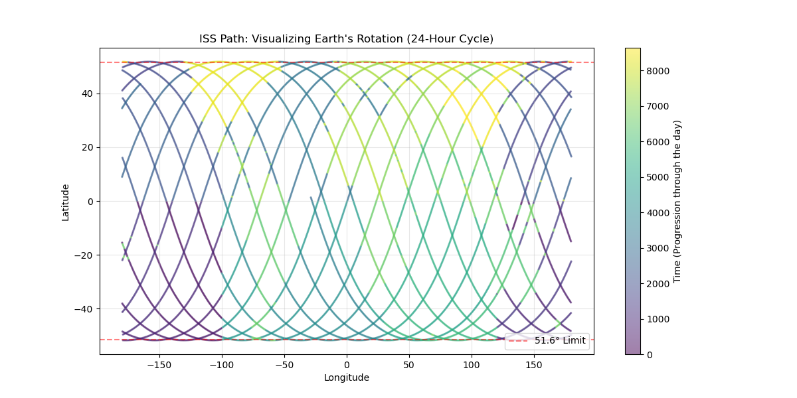

# ISS Telemetry Analytics: Mapping Orbital Bias & Physics

This project is a massive architectural evolution of a final project I originally completed for CMSE 201 at Michigan State University. In that original project, I used basic Pandas to plot International Space Station (ISS) coordinates to prove the existence of the "polar gap" and map orbital inclination bias. 

I wanted to take those early concepts and upgrade them into a proper, production-ready data engineering pipeline. This program ingests raw ISS telemetry data (timestamps, coordinates, altitude, velocity) and runs it through a series of modular, automated Python engines to extract deep geopolitical, astrodynamical, and physical insights.

## The Tech Stack & Architecture

Moving from a single, messy Jupyter Notebook to a modular Python pipeline required a shift in architecture. Here is the logic behind the codebase:

* **Separation of Concerns:** Jupyter Notebooks suffer from "hidden state" problems and aren't ideal for heavy data crunching. I migrated all mathematical logic, aggregations, and plotting functions into isolated `.py` files inside the `/scripts` directory. 
* **The Conductor Dashboard:** The `ISS_Advanced_Analysis.ipynb` notebook acts purely as a presentation layer. It imports the engines, feeds them the CSV data, and displays the generated assets. 
* **Automated Asset Generation:** The pipeline is designed so that the Python scripts automatically handle the generation and saving of high-resolution `matplotlib` PNGs directly to the `/assets` folder, keeping the user interface entirely hands-off.

## Conclusions
By running the raw telemetry data through our custom analytics engines, we arrived at the following core findings:

* **Legacy Mapping & Orbital Bias:** The ISS is locked into a 51.6° inclination, creating a massive "polar gap" at the top and bottom of the globe. Furthermore, the orbital geometry forces the station to physically dwell at its latitudinal maximums nearly 4.7x more often than the equator.
* **Global Band Tracking:** When comparing massive global cross-sections, the station provides significantly denser telemetry coverage across vertical (longitudinal) bands than horizontal (latitudinal) bands. This is due to the Earth's rotation constantly shifting the flight path westward on each 90-minute orbit.
* **Geopolitical Surveillance:** A granular breakdown of sovereign airspace reveals that the ISS primarily operates as an oceanic observer, spending the vast majority of its time over the South Atlantic and Pacific. When over land, coverage is heavily biased toward massive longitudinal targets or nations sitting directly along the 51.6° dwell line.
* **Orbital Physics & Decay:** Telemetry data proves the ISS constantly battles atmospheric drag, with altitude drops correlating directly with inherent velocity increases. This mathematically validates the laws of orbital mechanics acting on the station in Low Earth Orbit.
* **Astrodynamics & Solar Illumination:** By mapping longitudinal offsets to approximate local solar time, we tracked the station's rapid exposure to the terminator cycle. The data reflects a near-perfect 50/50 split between daylight and eclipse, aligning with the reality of the crew experiencing 16 sunrises daily.
* **Anomaly Detection & Re-boosts:** To counteract continuous orbital decay, ground control must execute targeted thruster re-boosts to raise the station's altitude. By isolating the top 1% of extreme altitude variances from a rolling average, our engine successfully pinpointed the exact timestamps of these mechanical interventions.
* **Telemetry Feed Health:** Despite traveling at 17,500 mph, the telemetry data stream remains flawlessly consistent. Our signal gap diagnostics recorded near-zero packet dropouts, proving the immense robustness of NASA's orbital transmission network.

*(For a deep-dive mathematical and geographical analysis of these specific findings, along with the generated data visualizations, please view the [Visualizations & Asset Gallery](./assets/README.md)).*

## How to Use & Repurpose This Repo
You can clone this repository and easily add your own global cities to the tracking engine.

1. **Clone the repository:** `git clone https://github.com/ishansinha5/ISS-Telemetry-Analytics.git`
2. **Install Dependencies:** `pip install pandas matplotlib numpy`
3. **Add your City:** Open `scripts/telemetry_utils.py`, find the `locations` dictionary in the `analyze_global_bands` function, and add your city's latitude and longitude bounds.
4. **Run the Dashboard:** Open `ISS_Advanced_Analysis.ipynb` and run the cells sequentially to regenerate the data visualizations for your targeted regions.