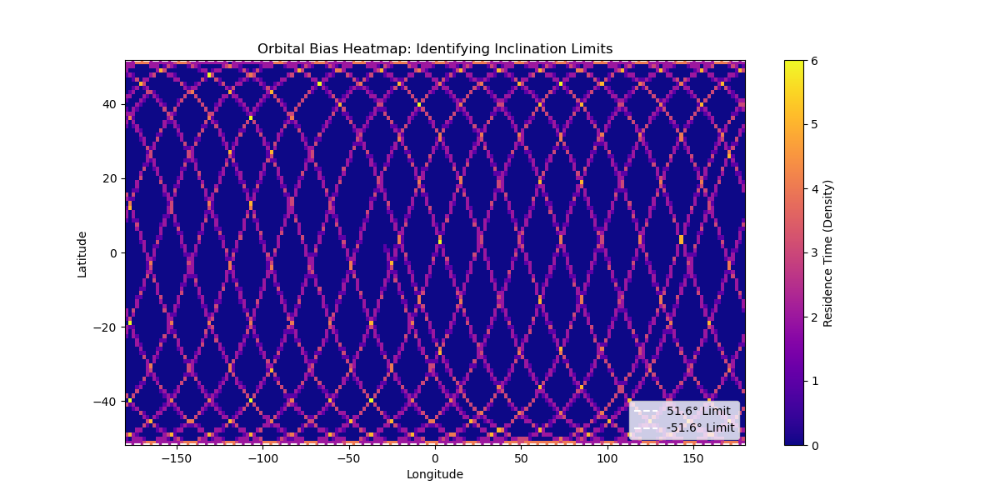
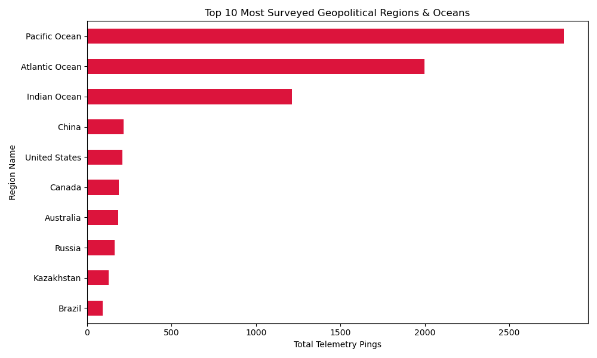
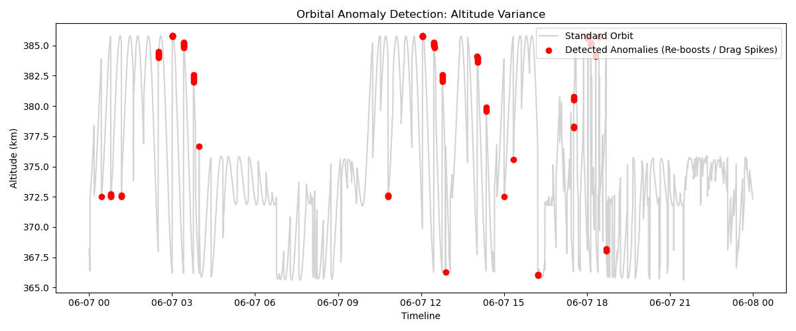
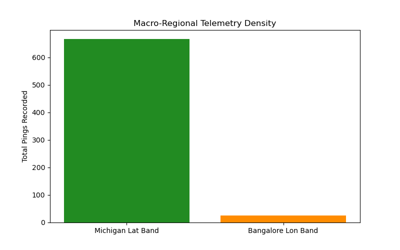

# Visualizations & Asset Gallery

This directory stores the automated visual outputs generated by the Python engines in the `/scripts` folder. The dashboard relies heavily on `matplotlib` to translate raw coordinate arrays and physics calculations into readable intelligence. 

*(Note: Because these files are generated dynamically upon running the notebook, pulling the repo and running the conductor will overwrite these images with the freshest data).*

### The Legacy Maps: Honoring CMSE 201
To honor the roots of the original project, the engine generates two global maps. The **Orbital Track** is a standard scatter plot colored by DataFrame index, perfectly visualizing the progression of time and the sine-wave nature of the orbit. The **Density Heatmap** utilizes a logarithmic `hexbin` plot to visually prove the "Orbital Bias"—the glowing yellow bands at the top and bottom of the map perfectly highlight the dwell time at the 51.6° limits.

---

### Geopolitical Surveillance
Instead of a standard pie chart, the geopolitical engine outputs a horizontal bar chart. This is a deliberate design choice, as horizontal bars are significantly cleaner when dealing with long, variable-length string names (like "South Atlantic Ocean"). 

---

### Orbital Anomalies & Re-boosts
This plot visualizes the variance math from the anomaly engine. The faint gray line represents the standard altitude timeline. The bright red scatters represent the 99th-percentile variances—pinpointing the exact timestamps where the ISS experienced extreme altitude corrections (thruster re-boosts).

---

### Global Band Tracking
To fairly track telemetry density across different parts of the world, this grouped bar chart visualizes full global cross-sections. It compares the total pings recorded across specific horizontal slices of the Earth (like Michigan's latitude band) against vertical slices (like Bangalore's longitude band).

