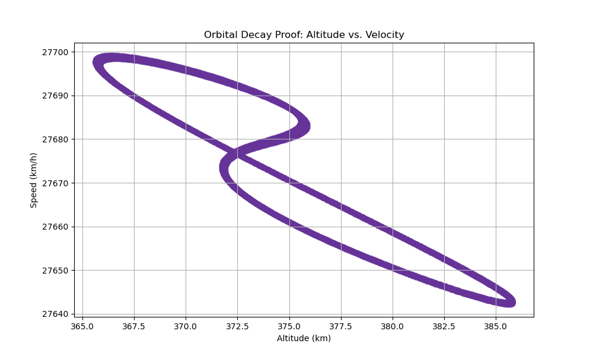
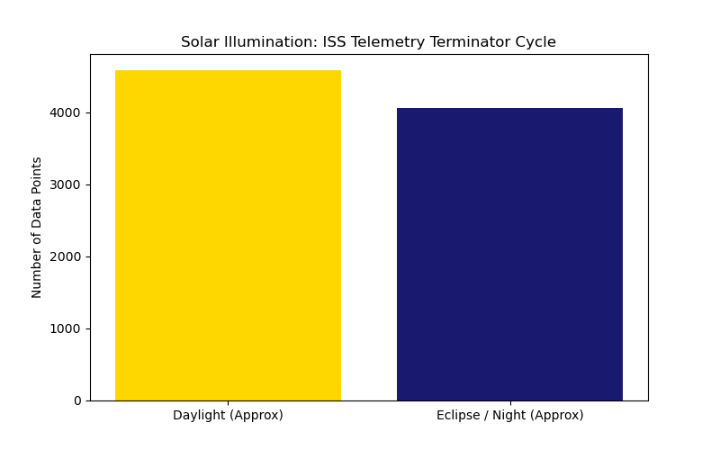
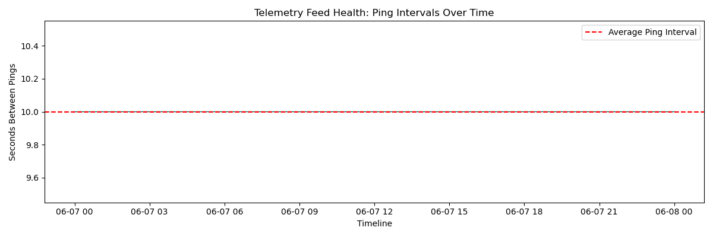

# Visualizations & Asset Gallery

This directory stores the automated visual outputs generated by the Python engines in the `/scripts` folder. The dashboard relies heavily on `matplotlib` to translate raw coordinate arrays and physics calculations into readable intelligence. 

*(Note: Because these files are generated dynamically upon running the conductor notebook, pulling the repository and running the pipeline will overwrite these images with the freshest data).*

---

### 1. Legacy Flight Path Mapping
**The Orbital Track (`legacy_orbital_track.png`)** A scatter plot colored by the DataFrame index, visualizing the continuous sine-wave nature of the orbit as the Earth rotates beneath the station.

**The Density Heatmap (`legacy_density_heatmap.png`)** This logarithmic `hexbin` plot is the ultimate visual proof of "Orbital Bias." Because the ISS travels in a sine-wave pattern relative to the equator, the derivative of its latitude with respect to time approaches zero at the peaks and valleys of its orbit. This means the station slows down its vertical geographic movement as it hits 51.6° North and South, causing it to "dwell" in those regions. The glowing yellow bands at the top and bottom of the map perfectly highlight this mathematical reality, proving the station spends significantly more time surveying the upper/lower hemispheres than crossing the equator.

---

### 2. Global Band Tracking (`macro_regional_bands.png`)
This grouped bar chart compares the total pings recorded across horizontal slices of the Earth (like the Michigan latitude band) against vertical slices (like Bangalore's longitude band). The analysis reveals a heavy bias toward longitudinal coverage. Because the Earth rotates beneath the ISS, the station's flight path shifts slightly westward on every single 90-minute orbit, essentially sweeping across all longitudinal lines repeatedly. Conversely, it only hits a specific latitudinal band (like Michigan) when the sine-wave arc aligns perfectly with that exact height, resulting in far fewer overall telemetry pings.

---

### 3. Geopolitical Surveillance (`granular_geopolitics_bar.png`)
This horizontal bar chart isolates the top 10 specific sovereign landmasses and bodies of water surveyed by the station. The analysis starkly highlights that the ISS primarily serves as an oceanic observer, spending the vast majority of its operational life over the South Atlantic and Pacific Oceans. When the station is over sovereign land, it is heavily biased toward massive longitudinal targets (like Russia or North America) or nations that sit directly along the 51.6° latitudinal dwell line, making those specific regions the most heavily surveyed landmasses on Earth.

---

### 4. Orbital Physics & Decay (`orbital_physics_scatter.png`)
The ISS operates in Low Earth Orbit (LEO), where it must constantly fight friction from the outer edges of the Earth's atmosphere. This scatter plot visually proves the mechanics of orbital decay by mapping the station's altitude directly against its velocity. The data demonstrates a clear negative correlation dictated by Kepler's laws of planetary motion. As atmospheric drag pulls the station closer to Earth (a shrinking orbital radius), its orbital velocity inherently increases to maintain angular momentum.

---

### 5. Astrodynamics & Solar Illumination (`astrodynamics_terminator.png`)
By calculating local solar time using longitudinal offsets (where 15 degrees of longitude equals 1 hour), this chart maps the station's exposure to the terminator cycle (Daylight versus Eclipse). Because the ISS orbits the Earth roughly every 90 minutes, the crew experiences 16 sunrises and 16 sunsets every single 24-hour period. The data perfectly reflects this rapid cycle, showing an approximate 50/50 split between telemetry points recorded in daylight versus those recorded in the shadow of the Earth.

---

### 6. Orbital Anomalies & Re-boosts (`orbital_anomalies.png`)
Because of the atmospheric drag and orbital decay proven in the physics module, the ISS cannot maintain its orbit indefinitely without intervention. By plotting a 15-period rolling average of the altitude, we filter out micro-fluctuations to establish a baseline. The bright red spikes represent the 99th-percentile variances from this baseline, allowing us to pinpoint the exact timestamps of "orbital anomalies." These spikes represent literal mechanical interventions by ground control, firing Russian Progress spacecraft thrusters to re-boost the 400,000kg station back into a stable altitude.

---

### 7. Telemetry Feed Health (`telemetry_dropout_analysis.png`)
In autonomous and remote systems, tracking packet loss and line-of-sight blind spots is a critical diagnostic metric. This chart calculates the exact time delta in seconds between every sequential data log. The analysis reveals an incredibly stable flatline, which serves as a testament to NASA's Tracking and Data Relay Satellite (TDRS) network. Despite traveling at 17,500 mph, there are practically zero line-of-sight dropouts, proving the extreme reliability of the orbital transmission feed.
